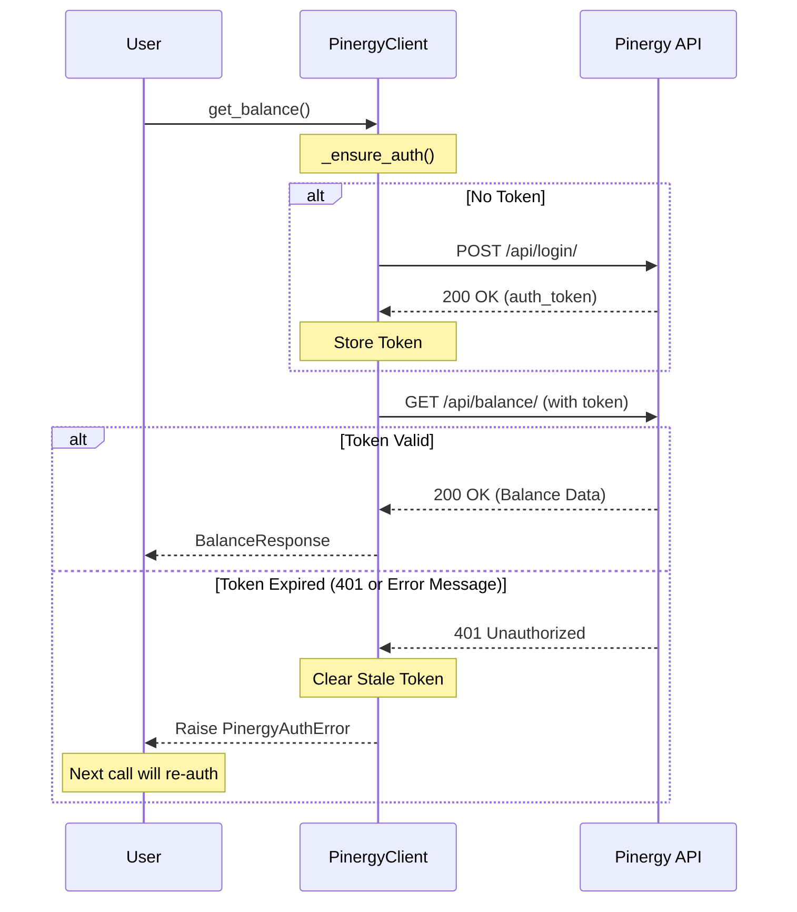

# Architecture Deep Dive

This document details the internal design and architectural decisions of the **PyPinergy** library.

## Overview

PyPinergy is designed as a lightweight, thread-safe, and defensive wrapper around the unofficial Pinergy API. It prioritizes ease of use (via lazy authentication) and stability (via defensive parsing).

---

## Core Components

### `PinergyClient`

The `PinergyClient` (in `client.py`) is the primary interface. It orchestrates:
- **Session Management:** Uses a custom `requests.Session` subclass (`_NoRedirectSession`) to manage connection pooling and prevent header leakage during redirects.
- **Lazy Authentication:** Implements a double-checked locking pattern using `threading.RLock` to ensure that authentication is performed exactly once (even in multi-threaded environments) only when a protected endpoint is hit.
- **Request/Response Lifecycle:** Handles URL building, header management (including `auth_token` injection), and mapping HTTP/JSON errors to the internal `PinergyError` hierarchy.

### Models (`models.py`)

Data returned from the API is modeled using standard Python `dataclasses`.

- **Defensive Parsing:** Each model implements a `_from_dict` class method. These methods use coercion helpers (`_to_int`, `_to_float`, `_as_dict`, etc.) to ensure that missing keys, `null` values, or unexpected types in the API response do not cause crashes. Fields instead fall back to sensible defaults (e.g., `0`, `""`, or `None`).
- **Performance:** For high-volume data (like usage entries), the models use `slots=True` (on Python 3.10+) to reduce memory footprint and improve attribute access speed.

### Exceptions (`exceptions.py`)

A flat hierarchy of exceptions rooted at `PinergyError`.
- **Granular Errors:** Separates transport-level issues (`PinergyHTTPError`, `PinergyTimeoutError`) from application-level issues (`PinergyAPIError`) and session issues (`PinergyAuthError`).

---

## Design Patterns

### Lazy Authentication

The client doesn't log in upon instantiation. Instead:
1. An API method calls `_ensure_auth()`.
2. `_ensure_auth()` checks if `_auth_token` is `None`.
3. If `None`, it acquires an `RLock` and performs the login.
4. If an authenticated request fails with an "invalid token" error (HTTP 401 or a specific API message), the client clears the token and raises `PinergyAuthError`, allowing the *next* call to transparently re-authenticate.

### Lazy Authentication Flow

The following diagram illustrates how the client handles authentication transparently during an API request.

### Connection Pooling

By inheriting from or wrapping `requests.Session`, the client benefits from HTTP Persistent Connections (keep-alive). This significantly reduces latency for subsequent API calls.

---

## Security Considerations

1. **Password Hashing:** Passwords are never stored in plaintext within the client. They are hashed immediately upon instantiation using a SHA-256 scheme required by the Pinergy API.
2. **Credential Discarding:** When `.logout()` is called, both the `auth_token` and the hashed password are deleted. This prevents the client object from being used for any further network activity.
3. **No Redirects:** The `_NoRedirectSession` ensures that sensitive headers (like `auth_token`) are not accidentally sent to a third-party domain if the API were to issue a redirect.
4. **HTTPS Enforcement:** The client enforces `https://` for the `base_url` (except for `localhost`) to prevent credential leakage over unencrypted channels.

---

## Transport Layer

The library uses the `requests` library for all network I/O. 

- **Timeout Management:** A global timeout is applied to all requests to prevent the client from hanging indefinitely.
- **Error Mapping:** 
    - `requests.Timeout` → `PinergyTimeoutError`
    - `response.raise_for_status()` → `PinergyHTTPError` (with special handling for 401)
    - `response.json()` failures → `PinergyResponseError`
